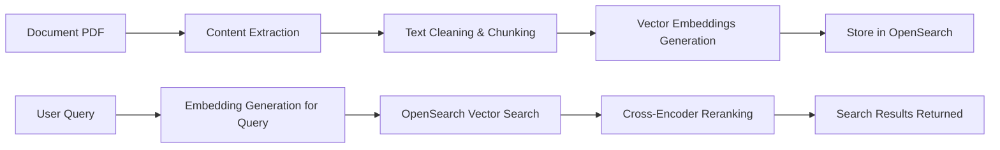

# Document Search Modernization Project

A modern document search system designed to replace legacy title-based search with a robust, AI-powered semantic search using **vector embeddings**, **OpenSearch**, and **cross-encoder reranking**. This system allows organizations to ingest documents and perform highly accurate content-based searches.

---

## Features

* **PDF Content Extraction**: Supports both scanned and text-based PDFs using `pypdf` and `easyocr`.
* **Text Preprocessing & Chunking**: Cleans and segments text using `spaCy` for better embedding and retrieval.
* **Vector Embeddings**: Generates embeddings for document chunks and stores them in **Apache OpenSearch** for efficient vector search.
* **Cross-Encoder Reranking**: Enhances search accuracy by reranking results based on semantic relevance.
* **REST API with FastAPI**:

  * Document ingestion endpoint
  * Search endpoint
  * Fully asynchronous and scalable

---

## Architecture Overview



---

## Installation

1. Clone the repository:

```bash
git clone https://github.com/your-org/document-search.git
cd document-search
```

2. Create and activate a virtual environment:

```bash
python -m venv venv
source venv/bin/activate   # Linux/macOS
venv\Scripts\activate      # Windows
```

3. Install dependencies:

```bash
pip install -r requirements.txt
```

4. Ensure **OpenSearch** is running and accessible. Update connection settings in `config.py` or environment variables.

---

## Usage

### Running the FastAPI Backend

```bash
uvicorn app.main:app --reload
```

### API Endpoints

1. **Ingest Documents**

```http
POST /api/documents
Content-Type: multipart/form-data
Body: file=<PDF File>
```

2. **Search Documents**

```http
POST /api/search
Content-Type: application/json
Body: { "query": "Your search text here", "top_k": 5 }
```

* Returns top-k most relevant documents with metadata and content snippets.

---

## Libraries & Tools Used

* **PDF & OCR Extraction**: `pypdf`, `easyocr`
* **NLP & Chunking**: `spaCy`
* **Embeddings & Reranking**: HuggingFace Transformers (embedding models + cross-encoder)
* **Search Engine**: Apache OpenSearch
* **Backend Framework**: FastAPI
* **Async & Scalability**: AsyncIO, FastAPI background tasks

---

## Example Workflow

1. Upload a document through `/api/documents`.
2. System extracts text, cleans it, and chunks it.
3. Embeddings are generated and stored in OpenSearch.
4. When a user searches via `/api/search`, embeddings for the query are generated.
5. OpenSearch retrieves top results based on vector similarity.
6. Cross-encoder reranks results to improve semantic relevance.
7. Final results with metadata are returned to the user.

---

## Contributing

1. Fork the repository
2. Create a new branch: `git checkout -b feature/my-feature`
3. Commit your changes: `git commit -am 'Add new feature'`
4. Push to the branch: `git push origin feature/my-feature`
5. Open a Pull Request

---
